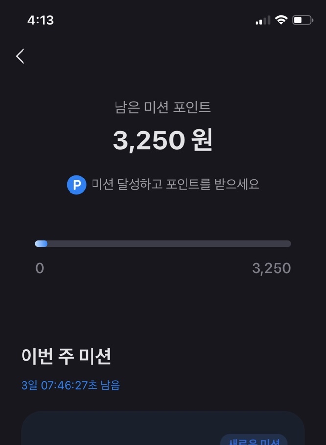
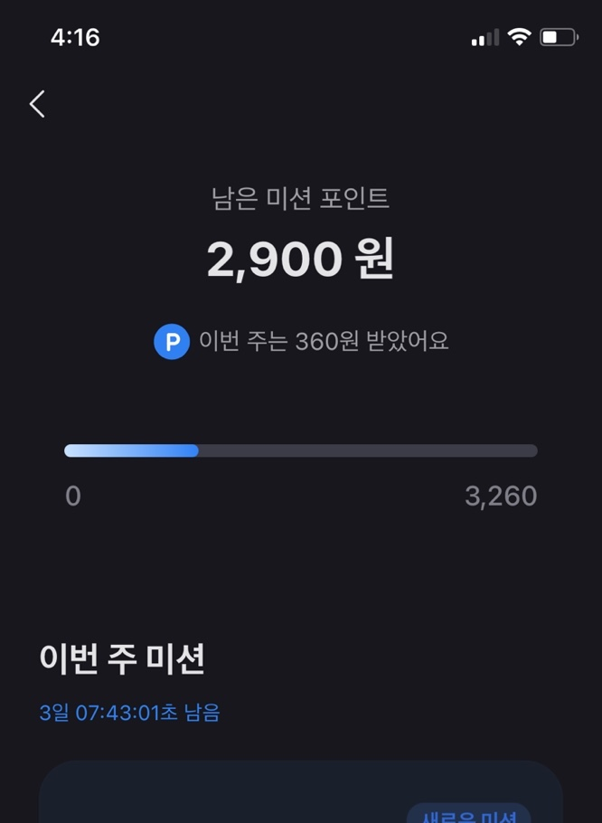
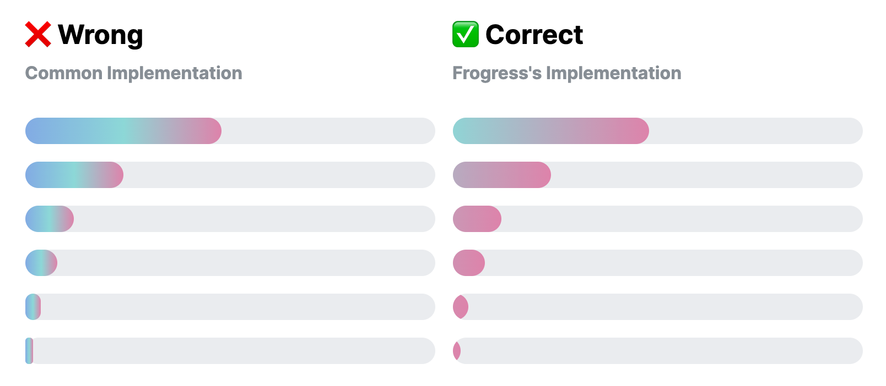
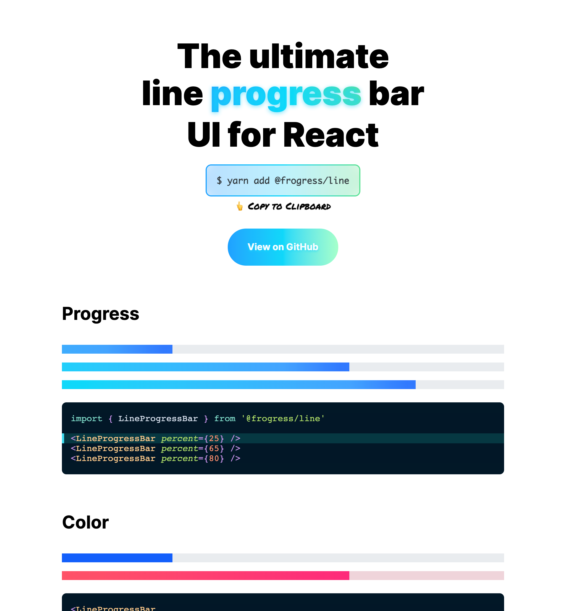

# Frogress

[](https://www.npmjs.com/package/@frogress/line)

> ❄️ The ultimate Line Progress Bar UI for React

# @frogress/line

## 📦 Installation

```bash
# Install peer depedencies
yarn add react react-dom styled-components framer-motion

# Install Frogress's Line Progress Bar component
yarn add @frogress/line
```

- `styled-components` will be replaced soon by React's internal `StyleSheet`(to reduce depedencies).
- `framer-motion` should be an optional depedency of those who wish to use `AnimatedLineProgressBar` of [#3](https://github.com/junhoyeo/frogress/pull/3). Will be fixed soon!

## 🚀 Usage

```tsx
import { LineProgressBar } from '@frogress/line'

<LineProgressBar percent={65} />
```

`percent` is the **percentage of the progress bar**(`number` type value with a range of `0` to `100`).
This property is required in TypeScript, but it will default to `0` if you ignore it.

## 💡 What problem does this solve?

### Examples of common traditional interfaces

| When progress indicator is short | When progress indicator is long |
|:----: | :---: |
|  |  |

### Comparison



Lots of existing line progress bar UIs do not support color gradients or rounded edges.

Most implementations it wrong. The upper-left image is the **most common mistake with inconsistent behavior;** Gradients are shrunk with the progress width, border-radius is working strangely with small values.

### 👓 Compile-time Type checking

```diff
- <LineProgressBar percent={-32} />
- <LineProgressBar percent={-1} />

+ <LineProgressBar percent={0} />
+ <LineProgressBar percent={45} />
+ <LineProgressBar percent={100} />

- <LineProgressBar percent={101} />
- <LineProgressBar percent={9999} />
```

The type is enforced so that **only integers within the correct range are allowed.**

## 🌸 Styling

TBD

### Size

### Color

### Rounding

### Direction

# @frogress/docs

<p align="center">

  <a href="https://frogress.vercel.app">
    
  </a>
  <blockquote align="center"><a href="https://frogress.vercel.app">📖 Documentation</a></blockquote>
</p>

## Development

```bash
# 🖨 Clone git repository
git clone https://github.com/junhoyeo/frogress
cd frogress

# 📦 Install depedencies
yarn install

# 🔨 Build @frogress/line
yarn workspace @frogress/line build

# 🏃‍♀️ Run development server for @frogress/docs
yarn workspace @frogress/docs dev

# 🚀 Build & Deploy
git commit -m "@frogress/line@x.y.z"
git tag x.y.z
yarn workspace @frogress/line build
yarn workspace @frogress/line npm publish --access=public
git push --tags
git push
```
